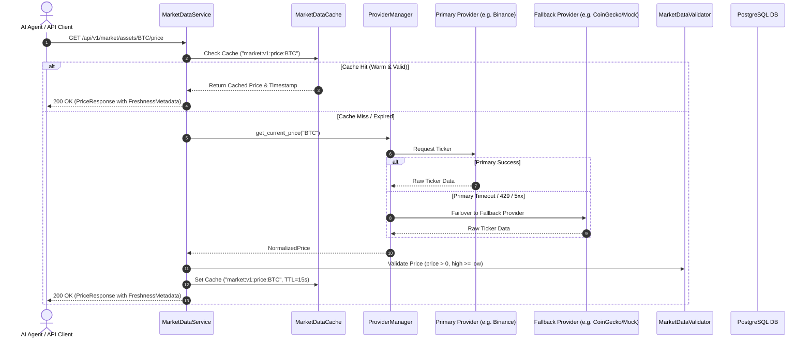

# AI TradeQ — Market Data Intelligence Architecture

**Document Version:** 1.0  
**Status:** Approved  
**Module:** Market Data Intelligence Foundation (Task #003)  
**Classification:** Engineering Architecture  

---

## 1. Executive Overview

The **Market Data Intelligence Foundation** provides an enterprise-grade, provider-agnostic market data layer designed to supply reliable, validated, timestamped cryptocurrency market data to downstream AI reasoning engines, quantitative models, and the user interface.

### Architectural Core Principles
- **Provider Agnosticism**: Standardized `BaseMarketDataProvider` interface decoupling business logic from third-party vendor APIs.
- **Multi-Provider Fallback**: Transparent failover from primary providers (CoinGecko/Binance) to fallback providers during downtime or rate limiting.
- **Deterministic Multi-Tier Caching**: Versioned namespaced Redis/in-memory cache keys with granular TTLs.
- **Mathematical Integrity Validation**: Strict validation rejecting corrupt OHLC relationships, negative volume, or invalid price spikes.
- **Observable Freshness Tracking**: Source vs. ingestion timestamp tracking with configurable staleness detection.

---

## 2. Market Data Flow & Fallback Architecture

---

## 3. Database Schema

### `crypto_assets` Entity
- `id`: UUID (Primary Key)
- `symbol`: VARCHAR(20) (Indexed)
- `name`: VARCHAR(100)
- `slug`: VARCHAR(100) (Indexed)
- `provider_id`: VARCHAR(100) (Indexed)
- `asset_type`: VARCHAR(20) (Default `crypto`)
- `status`: VARCHAR(20) (Default `active`, Indexed)
- `is_active`: BOOLEAN (Default `true`)
- `rank`: INTEGER (Nullable)
- `metadata_json`: TEXT (JSON Metadata)
- `created_at` / `updated_at`: TIMESTAMP WITH TIME ZONE

### `market_snapshots` Entity
- `id`: UUID (Primary Key)
- `asset_id`: UUID (Foreign Key -> `crypto_assets.id` ON DELETE CASCADE)
- `price`: DOUBLE PRECISION
- `market_cap`: DOUBLE PRECISION
- `volume_24h`: DOUBLE PRECISION
- `price_change_24h`: DOUBLE PRECISION
- `price_change_percentage_24h`: DOUBLE PRECISION
- `high_24h` / `low_24h`: DOUBLE PRECISION
- `circulating_supply` / `total_supply`: DOUBLE PRECISION
- `provider`: VARCHAR(50)
- `data_timestamp`: TIMESTAMP WITH TIME ZONE
- `ingested_at`: TIMESTAMP WITH TIME ZONE

### `ohlcv_candles` Entity
- `id`: UUID (Primary Key)
- `asset_id`: UUID (Foreign Key -> `crypto_assets.id` ON DELETE CASCADE)
- `timeframe`: VARCHAR(10) (`1m`, `5m`, `15m`, `30m`, `1h`, `4h`, `1d`, `1w`)
- `open`, `high`, `low`, `close`, `volume`: DOUBLE PRECISION
- `candle_timestamp`: TIMESTAMP WITH TIME ZONE
- `provider`: VARCHAR(50)
- `ingested_at`: TIMESTAMP WITH TIME ZONE
- **Unique Constraint**: `(asset_id, timeframe, candle_timestamp, provider)`

---

## 4. Supported Timeframes

The platform centrally standardizes candlestick timeframes:
- `1m`: 1 Minute (60 seconds)
- `5m`: 5 Minutes (300 seconds)
- `15m`: 15 Minutes (900 seconds)
- `30m`: 30 Minutes (1800 seconds)
- `1h`: 1 Hour (3600 seconds)
- `4h`: 4 Hours (14400 seconds)
- `1d`: 1 Day (86400 seconds)
- `1w`: 1 Week (604800 seconds)

---

## 5. Caching Strategy & TTLs

| Data Type | Cache Key Pattern | Default TTL | Rationale |
| :--- | :--- | :--- | :--- |
| **Real-time Price** | `market:v1:price:{symbol}` | 15 seconds | Balances real-time accuracy with provider rate limits |
| **Market Snapshot** | `market:v1:snapshot:{symbol}` | 60 seconds | 24h aggregate metrics change slowly |
| **OHLCV Candles** | `market:v1:ohlcv:{symbol}:{timeframe}:{limit}` | 60 seconds | Cache candle batch queries |
| **Asset Metadata** | `market:v1:asset:{symbol_or_id}` | 3600 seconds | Static metadata rarely updates |
| **Asset List** | `market:v1:assets:list` | 3600 seconds | Registry list caching |
