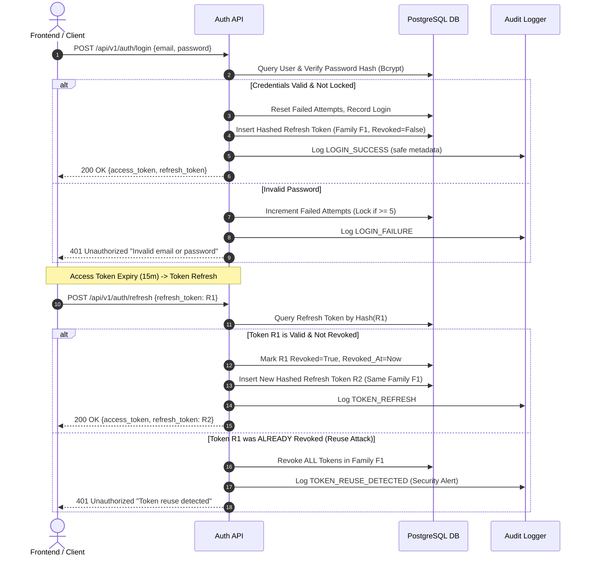

# AI TradeQ — Authentication & Identity Architecture

**Document Version:** 1.0  
**Status:** Approved  
**Module:** Authentication & Identity Management (Task #002)  
**Classification:** Engineering Architecture  

---

## 1. Overview

The AI TradeQ Authentication & Identity Management subsystem provides enterprise-grade identity lifecycle management, session orchestration, and role-based access control (RBAC).

### Key Architectural Pillars
- **Stateless Access Token Authentication**: Short-lived (15 minutes) signed JSON Web Tokens (JWT) containing standard claims (`sub`, `roles`, `permissions`, `jti`, `exp`, `iat`).
- **Stateful Refresh Token Rotation**: Long-lived (7 days) refresh tokens stored in hashed format with token family tracking, revocation mechanisms, and automatic reuse detection.
- **Role-Based Access Control (RBAC)**: Fine-grained permissions and hierarchical roles (`SUPER_ADMIN`, `ADMIN`, `ANALYST`, `USER`).
- **Account Lockout & Brute-Force Defense**: Configurable failure thresholds (5 attempts) triggering temporal lockouts (15 minutes).
- **Zero-Leakage Audit Logging**: Asynchronous security audit event recording with automatic redaction of credentials, tokens, and secrets.

---

## 2. Token Lifecycle & Family Rotation

---

## 3. Database Entity Schema

### User Entity (`users`)
- `id` (UUID, Primary Key)
- `email` (VARCHAR 255, Unique, Indexed)
- `password_hash` (VARCHAR 255, Bcrypt Hash)
- `first_name` (VARCHAR 100, Nullable)
- `last_name` (VARCHAR 100, Nullable)
- `is_active` (BOOLEAN, Default True)
- `is_verified` (BOOLEAN, Default False)
- `is_locked` (BOOLEAN, Default False)
- `failed_login_attempts` (INTEGER, Default 0)
- `locked_until` (TIMESTAMP WITH TIME ZONE, Nullable)
- `created_at` (TIMESTAMP WITH TIME ZONE, Server Default Now)
- `updated_at` (TIMESTAMP WITH TIME ZONE, Server Default Now)
- `last_login_at` (TIMESTAMP WITH TIME ZONE, Nullable)

### Refresh Token Entity (`refresh_tokens`)
- `id` (UUID, Primary Key)
- `user_id` (UUID, Foreign Key -> `users.id` ON DELETE CASCADE)
- `token_hash` (VARCHAR 255, Unique, SHA-256 Hash of raw token)
- `family_id` (UUID, Indexed)
- `is_revoked` (BOOLEAN, Default False)
- `expires_at` (TIMESTAMP WITH TIME ZONE)
- `created_at` (TIMESTAMP WITH TIME ZONE)
- `revoked_at` (TIMESTAMP WITH TIME ZONE, Nullable)
- `user_agent` (VARCHAR 255, Nullable)
- `ip_address` (VARCHAR 45, Nullable)

### RBAC Entities (`roles`, `permissions`, `user_roles`, `role_permissions`)
- Many-to-many relationship connecting users to roles, and roles to granular permissions.

### Security Audit Log (`auth_audit_logs`)
- `id` (UUID, Primary Key)
- `user_id` (UUID, Nullable, Foreign Key -> `users.id` ON DELETE SET NULL)
- `event_type` (VARCHAR 50, Indexed)
- `status` (VARCHAR 20: SUCCESS, FAILURE, LOCKED, SECURITY_ALERT)
- `ip_address` (VARCHAR 45, Nullable)
- `user_agent` (VARCHAR 255, Nullable)
- `correlation_id` (VARCHAR 100, Nullable)
- `details` (TEXT / JSON, Strictly Redacted)
- `created_at` (TIMESTAMP WITH TIME ZONE)
